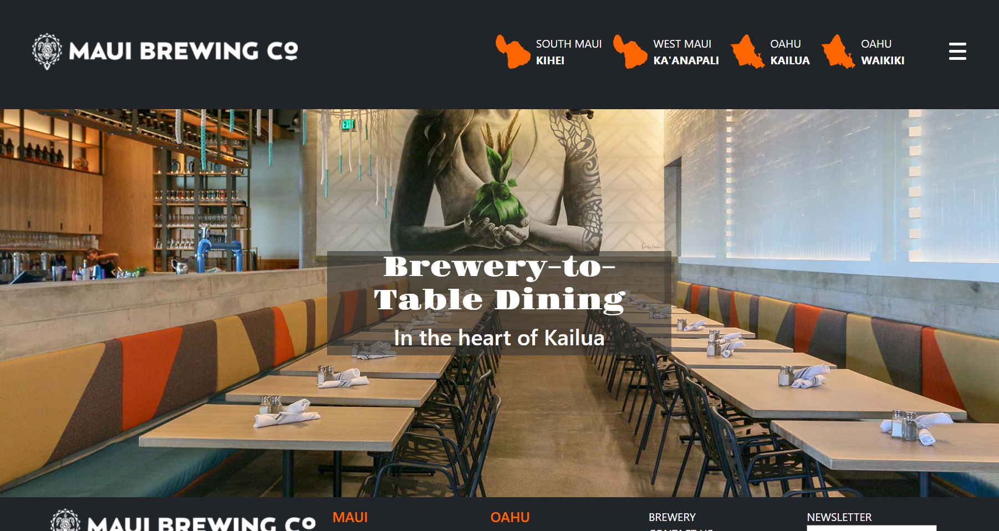

## Experience
In order to begin developing skills in front end development, it is necessary to familiarize yourself with the potential of pure CSS and HTML. Throughout my courses, I have only been involved in utilizing the core principles of CSS and HTML to construct websites to build a stable foundational knowledge. Just as I was starting to become comfortable with these concepts, we began investing our time in UI frameworks. 

Bootstrap 5 builds off the elements I learned, and expands 

***

## 
