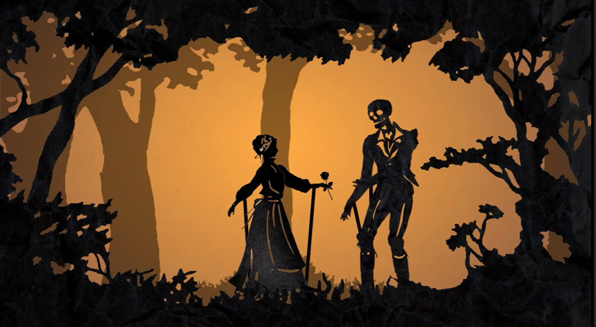

## About

The animation was created using Unity, and initially, I aimed at creating a heartwarming rendition of The Legend of Sleepy Hollow while still keeping its inherent spooky atmosphere. The style I chose was somewhat reminiscent of an old-fashioned puppet show mixed with the creepy animation seen in the early 2000s when the animation was creative, yet stilted and a little strange.

## Concepts

Characters were manually rigged in Unity, equipped with bone structures inside their limbs to make movement possible and to simulate that puppet-feel. Additionally, the majority of objects used in the video were created from scratch within Photoshop. Before starting to work on animations, I had to develop a concept of all objects used since I was making everything on my own.  Making animations was a tedious task, as I had to work on every frame by myself and create a movement pattern which would be as natural as possible yet maintaining the expected stiffness displayed in puppet animation. 

One of the best things about this project was the prologue, which I decided to give to the Headless Horseman because I wanted him to have a tragic backstory before entering into the plot. In order to emphasize that, I chose to depict the prologue in the style of shadow puppets to differentiate it visually from the rest of the narrative. Music was also an important part of the process because the tone of the project hinged entirely on it, and therefore I spent considerable time looking for the right piece without which nothing else would work.

Now that it's done, I realize that this project taught me new things in unexpected ways. As someone used to working with traditional tools of animation, making this film in Unity and then creating all visual elements of it was challenging, but rewarding.

---

    
    
<em>Another Tale From Sleepy Hollow</em>

