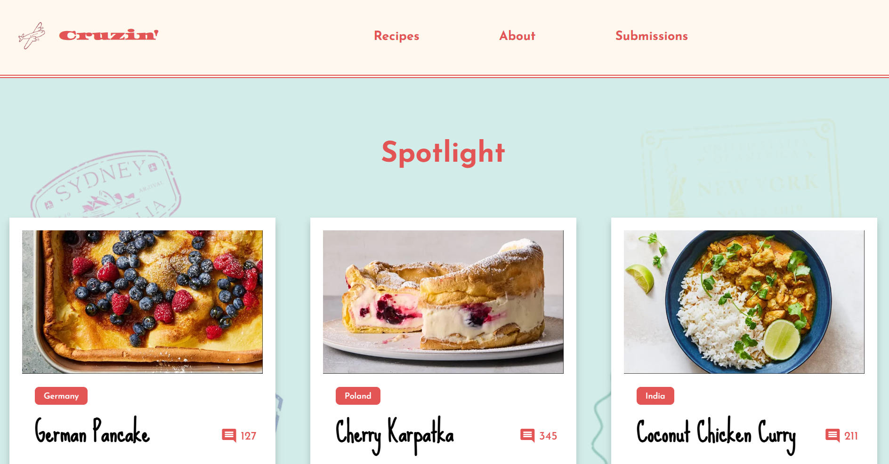

## About Cruzin'

**Cruzin'** was a project that let me combine two things I find genuinely exciting: thoughtful design and the idea that food tells a story about where it comes from.

The concept was built around the metaphor of travel. Instead of just browsing recipes, I wanted the experience to feel like planning a trip. Picking a destination, choosing your skill level, grabbing your ingredients, and setting off. It was inspired by my love of travel, and the trouble I always face when baking: what to make? The result was a stylized single-page site that advertises the concept of filling out a quiz to get a ticket to your perfect recipe. 

On the technical side, I built the site using HTML, CSS, and JavaScript without relying on many frameworks, just a clean custom base I put together myself. Getting the responsive layout right took real thought, especially making sure the grid, typography, and section transitions all held up across screen sizes. 

## Design

Visually, I wanted it to feel warm and a little nostalgic, like a vintage travel poster mixed with a handwritten recipe card. The color palette, the font pairings, the scalloped section mask on the recipes area: those details mattered to me because they're what make a site feel like something rather than just function like something.

Looking back, Cruzin' taught me a lot about how design and code work together. It's one thing to have a visual idea, and another to actually build it. This project pushed me to do both.

    
    
<em>Home Page</em>

