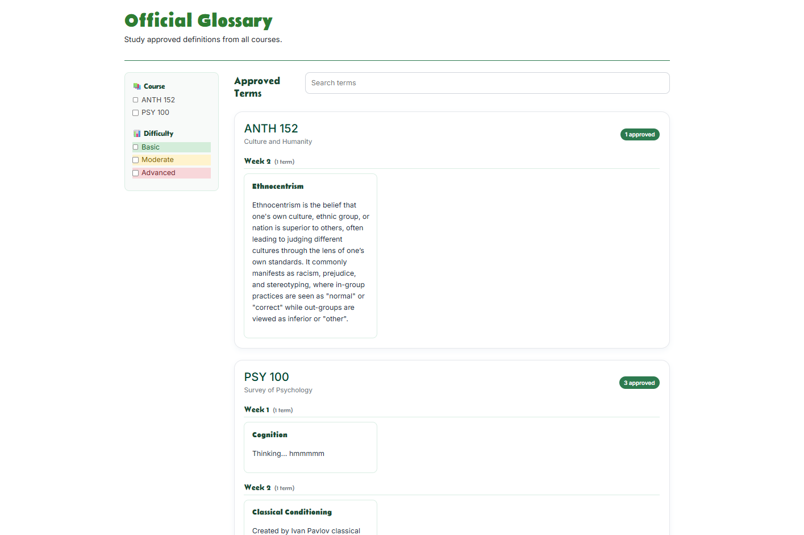
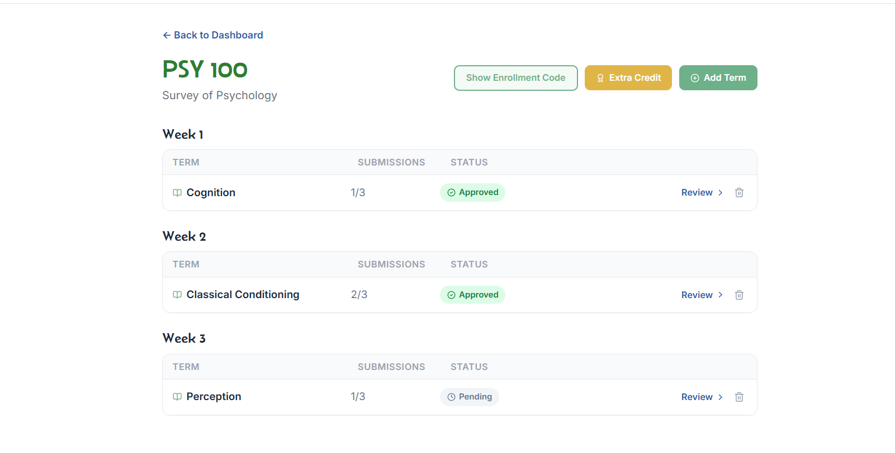
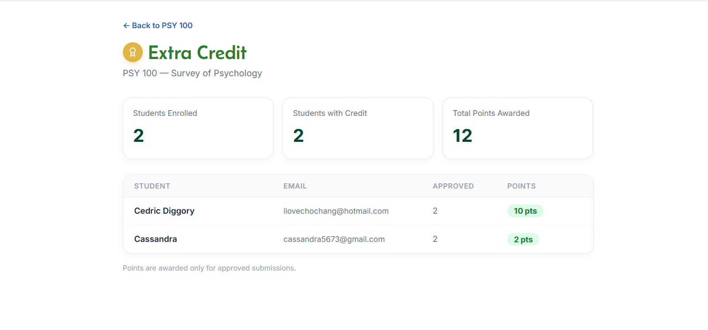

## StudyViser Github
[Link to Github Organization](https://github.com/study-viser)

## Overview

StudyViser is a collaborative web platform designed to solve an important cademic challenge: students struggling to find structured, verified study materials tailored to their specific courses. The core idea is simple, instead of leaving students to piece together resources from scattered resources, StudyViser creates a community-driven space where study materials are created, reviewed, and approved within the course itself. The platform is live and accessible over Vercel.

The platform is built around two distinct user roles: instructors and students. Instructors define what study materials their course needs, glossary terms, and set extra credit values for quality contributions. Students enroll in courses, submit definitions for glossary terms, and earn extra credit when their submission is selected. The competitive submission model (per-student and per-term caps) encourages meaningful contributions rather than bulk submissions, ensuring every approved entry is genuinely useful. Beyond content creation, StudyViser also features a built-in study experience. Students can browse the official glossary, filter terms by course, difficulty, or week, use flashcard mode to self-assess their knowledge. 

## About the Team

The project was built by a five-person team: Noah Asano, Michaela Gillan, Seonwoo Kim, Khloe Valera, and Marie Wong. Together, we handled everything from designing the system architecture and database models to building out the frontend in Next.js and TypeScript, implementing role-based dashboards, and deploying the full application. The team operated under a formal team contract and managed their work across organized GitHub milestones, demonstrating both technical skill and strong collaborative process throughout the project.​​​​​​​​​​​​​​​​

## My Contributions

My main contribution was building the Instructor Dashboard. I created the layout and all the components on the page — a row of stat cards showing things like how many terms had been approved and how many new submissions came in, a table showing the status of each glossary term per course, and a recent activity feed showing the latest student submissions. I also wrote the database queries on the backend to pull all that information together, which involved fetching courses, terms, and submissions in one go.

## What I Learned

This project taught me a lot about how frontend and backend work together in a real application. Writing database queries that pull from multiple related tables was something I hadn't done much before, and it helped me understand how the data model affects what you can actually display in the UI. I also got more comfortable with Next.js and TypeScript through the process of building something that needed to work with real, live data.

## Screenshots

  

    
    
<em>Home Page</em>

  

  

    
    
<em>Official Glossary</em>

  

  

    
    
<em>Instructor Course Page</em>

  

  

    
    
<em>Instructor Extra Credit</em>

  

